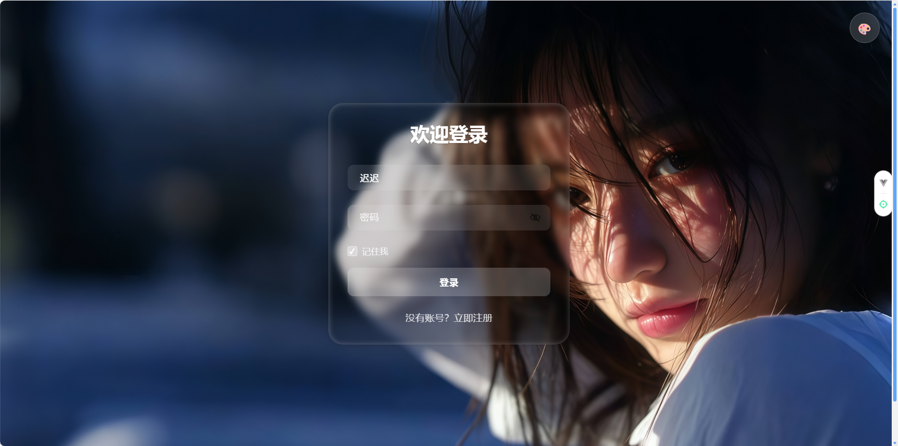
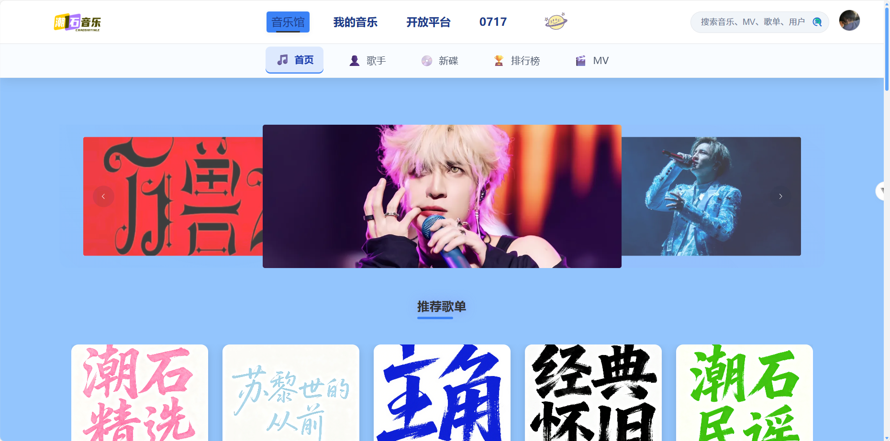
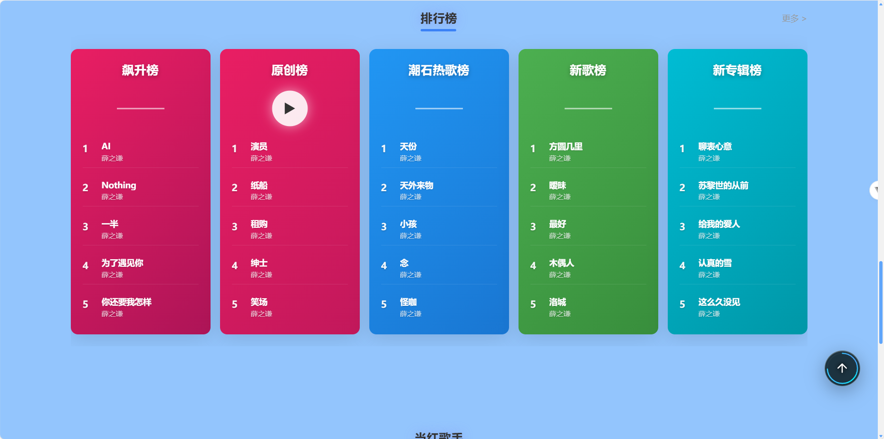
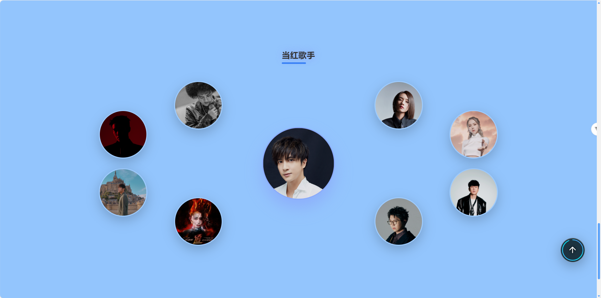
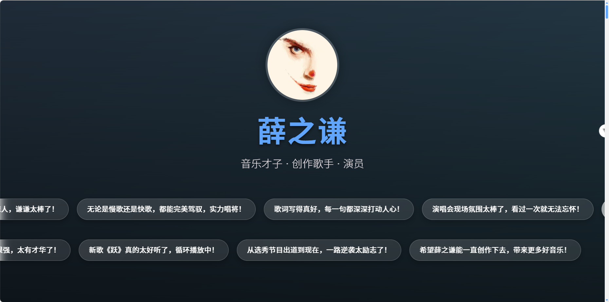
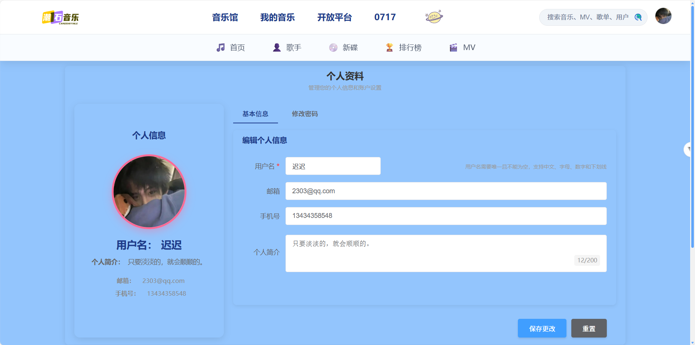

# 潮石音乐 / Chaoshi Music

<p align="center">
  
</p>

一个仿网易云风格的在线音乐平台，包含前后端完整项目：

- **前端**：Vue 3 + Vite + Element Plus（`music-client`）
- **后端**：Spring Boot (JDK 21)（`music-server`）
- **存储**：MySQL + MinIO（文件存储）
- **核心功能**：在线播放、全屏播放器、歌词展示、自定义背景墙、搜索历史、排行榜、消消乐小游戏等

---

## 技术栈 / Tech Stack

| 前端 | 后端 | 数据库 & 存储 |
|------|------|---------------|
| Vue 3 | Spring Boot 3 | MySQL 8.0 |
| Vite | MyBatis | MinIO |
| Element Plus | Spring Security | Redis (可选) |
| Pinia | JWT | |

---

## 运行说明 / Getting Started

### 环境要求 / Requirements

- **Node.js** 18+
- **npm** 或 yarn（用于前端）
- **JDK** 21
- **Maven**（如果你使用命令行运行后端）
- **MySQL** 8.0+
- **MinIO**（用于头像和背景图上传）

---

## 快速开始 / Quick Start

### 1. 克隆项目

```bash
git clone https://github.com/your-username/chaoshi-music.git
cd chaoshi-music
```

### 2. 配置后端

```bash
cd music-server/src/main/resources

# 复制配置模板
cp application.properties.example application.properties

# 编辑 application.properties，填入你的数据库和 MinIO 配置
```

### 3. 启动后端

```bash
cd music-server
mvn spring-boot:run
```

- 默认端口：`8081`
- API 文档：`http://localhost:8081/swagger-ui.html`

### 4. 启动前端

```bash
cd music-client
npm install
npm run dev
```

- 默认访问：`http://localhost:5173/`

---

## 主要功能 / Main Features

### 播放器 / Player

- 底部迷你播放器：
  - 播放 / 暂停 / 上一首 / 下一首
  - 进度条拖拽
  - 音量调节（悬浮竖向滑块）
  - 收藏按钮 & 播放模式切换、播放列表弹窗
- 全屏播放器：
  - 左右两侧 **半圈白色线条波浪**（固定节奏扩散）
  - 左右背景 **半圈波浪随音乐节奏动态波动**
  - 底部三行歌词显示
  - 大歌词模式（中间大字 + 完整歌词列表）
  - ESC / 点击返回关闭全屏

### 背景与主题 / Background & Themes

- 顶部「更换背景」面板：
  - 预设背景图（如星空、城市等）
  - 上传本地图片作为背景
  - 记录最近使用的 8 张背景图，按时间顺序展示
- 主题色：
  - 黑色主题下，全屏播放器背景为纯黑 + 半圈白色波浪，突出播放效果
  - 彩色主题下，背景为主题色 + 半透明遮罩，增强波浪对比度

### 用户 & 搜索 / User & Search

- 用户注册 / 登录（使用加密密码和 JWT 令牌）
- 修改个人资料、头像、背景图
- 搜索历史记录：
  - 保存用户搜索关键词
  - 支持获取历史记录、热门搜索、清空历史等

### 排行榜 / Toplists

- 创建 / 更新 / 删除排行榜
- 获取热门 / 最新排行榜
- 为排行榜添加 / 删除歌曲，更新歌曲排名，清空排行榜歌曲

---

## 效果展示 / Screenshots

### 首页 / Home



### 播放器 / Player


### 全屏播放器 / Fullscreen Player


### 我的音乐 / My Music



### 歌单详情 / Playlist Detail



### 搜索页面 / Search


### 消消乐小游戏 / Match Game



### 登录注册 / Login



---

## 项目结构 / Project Structure

```text
chaoshi-music/
├─ music-client/      # 前端 Vue 3 + Vite 项目 / Frontend project
│  ├─ src/
│  └─ ...
├─ music-server/      # 后端 Spring Boot 项目 / Backend project
│  ├─ src/main/java/com/chaoshi
│  └─ ...
└─ README.md
```

---

## 开发者提示 / Developer Notes

- 前端使用全局 `musicPlayer.js` 管理播放状态，`MusicPlayer.vue` 与 `FullscreenPlayer.vue` 共用同一套状态。
- 背景图片通过 `HeaderNav.vue` 触发 `background-changed` 事件，由 `App.vue` 监听并应用到 `document.body`。
- 用户头像和背景图上传通过 MinIO（`FileUploadService` & `MinioFileUploadServiceImpl`）处理，返回可直接使用的 URL。

---

如需英文更详细的 API / 模块说明，可以在后续增加 `docs/` 目录单独写文档。  
If you need more detailed English API/module docs, you can later add a `docs/` folder.
